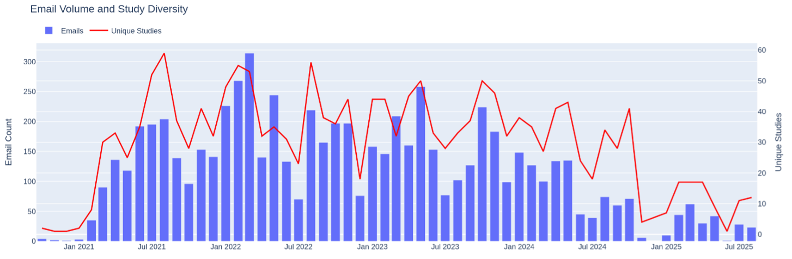
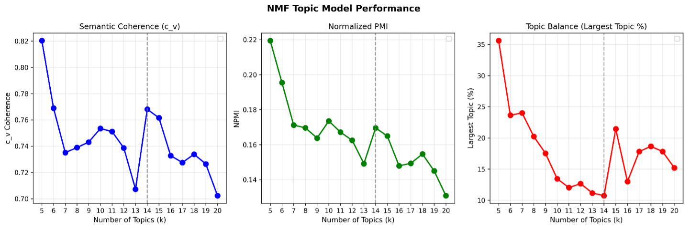
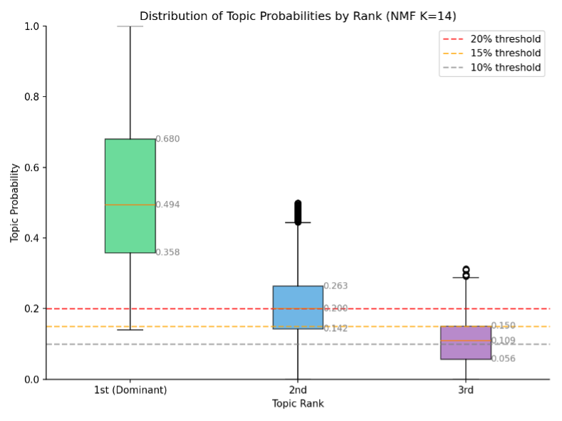
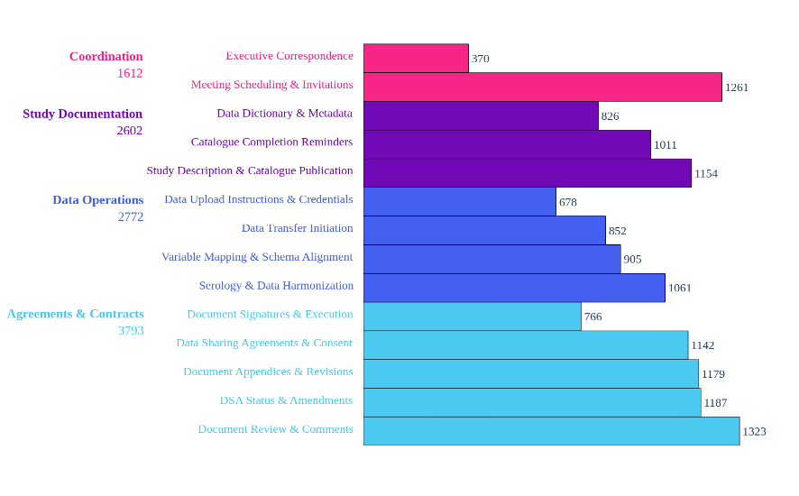
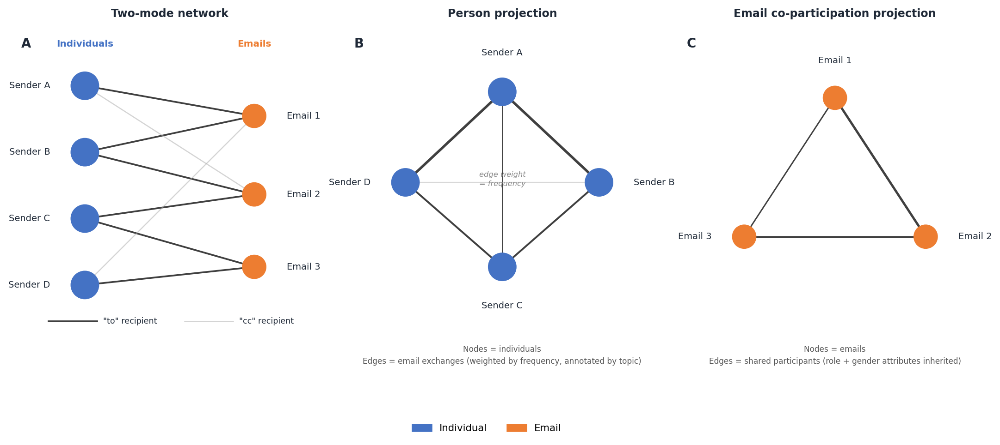

This document outlines the overall vision, methodological approach, and analytical strategy for the project *Mapping the Administrative Processes of Research Data Sharing: Analysis of Operational Email Correspondence from the Canadian COVID-19 Immunity Task Force Databank*. It is intended as a living reference that evolves alongside the project, articulating decisions at the level of design and strategy rather than documenting granular operational steps, which are covered in dedicated sub-protocols.

## Motivation and Problem Statement

Health data sharing is widely understood as a technical challenge — one of interoperability, access infrastructure, and standardization. But for those who actually coordinate it, the experience is primarily organizational: negotiating agreements across institutions, aligning diverse stakeholders with incompatible timelines, and sustaining collaborative relationships under conditions of uncertainty and urgency. These organizational dimensions have remained largely invisible in research on health data infrastructure, crowded out by a strong emphasis on technical solutions.

This project takes the organizational dimensions of health data sharing seriously as objects of empirical investigation. It does so by analyzing the administrative correspondence generated during the creation and operation of the COVID-19 Immunity Task Force (CITF) Databank — a pan-Canadian initiative that assembled health records from over 100 COVID-19 studies across the country. The Databank's email archive is a dense record of the coordination work that made data sharing happen: who communicated with whom, about what, and when.

The project builds on a pilot study that demonstrated the analytical viability of this approach. Using topic modeling applied to approximately 7,000 emails from the central operations manager's mailbox, the pilot identified 14 coherent topics organized into four thematic clusters and surfaced a set of findings about the structure and timing of coordination work, now reported in the [topic modelling paper](../topic-modelling/). The proposed project expands on this foundation by enlarging the corpus, extending the analysis to include network-level communication patterns and data complexity effects, and complementing the quantitative findings with qualitative interviews.

## Research Objectives

The project pursues two interrelated objectives:

**Objective 1: Characterize the coordination processes among the CITF Databank's partners, core Databank personnel, and other related stakeholders.** This extends the pilot study's descriptive account of what people communicated about and when, adding analysis of the communication structures through which coordination was enacted — who interacted with whom, how frequently, and in what thematic contexts.

**Objective 2: Identify human and organizational determinants of observed coordination behaviours.** This shifts the analytical register from description to explanation. Semi-structured interviews with CITF Databank partners will provide participants' own accounts of why certain processes were more effortful, how prior experiences shaped their engagement, and what organizational factors facilitated or impeded data sharing.

Together, these objectives follow an explanatory sequential mixed-methods logic: the quantitative analysis identifies patterns and raises questions; the qualitative component pursues explanations by drawing on participants' situated knowledge.

## Case Description

The CITF Databank serves as the empirical case for this study. Established in April 2020, the CITF was mandated to catalyze, fund, and harmonize knowledge about SARS-CoV-2 immunity to support federal, provincial, and territorial decision-making. The Databank centralized research data from CITF-funded studies, ultimately assembling a harmonized dataset drawing on over 165,000 individual participant health records from studies conducted across Canada.

The Databank's pan-Canadian scope — involving data sharing across multiple universities, research institutes, hospitals, and governmental agencies, under pandemic conditions — makes it an unusually rich setting for examining how large-scale health data sharing governance is coordinated in practice. It is neither a routine data request nor a purpose-built federated infrastructure, but something in between: a concentrated administrative effort to retrofit collaborative data sharing onto an ecosystem of independently conducted studies with heterogeneous governance arrangements.

The Databank was led by a core team within the CITF Secretariat, supported by dedicated personnel at McGill University's Office of Sponsored Research and by external experts in data governance and harmonization. This organizational structure — a central operational core interacting with distributed study teams and external institutional partners — is reflected directly in the email corpus and is a primary object of analysis.

## Data Sources

### Email Corpus

The primary data source is the email archive of the CITF Databank. The pilot study analyzed 6,833 emails from the inbox of the Databank's central operations manager, covering correspondence with 100 partner studies from February 2021 to September 2025 (@fig-email-volume).

{#fig-email-volume}

The proposed project expands this corpus in two directions. First, the remaining ~22,500 emails from the same operations manager's mailbox — linked to broader CITF operational communications not yet associated with specific studies — will be integrated, approximately doubling the analytical corpus while maintaining the operational perspective established in the pilot. Second, emails from the CITF Databank's Scientific Director and data analysts will be incorporated. The Scientific Director's mailbox alone comprises approximately 19,000 emails, adding a senior governance perspective that complements the ground-level operational view and enables triangulation across different organizational roles. The expansion proceeds iteratively: the data processing and analysis pipeline validated through the pilot is applied to each new mailbox in sequence, with the corpus growing in a controlled and documented fashion.

### Interviews

The secondary data source is a set of semi-structured interviews with individuals who participated in the CITF Databank initiative, primarily on the partner-study side. Participants will be identified through a call for participation addressed to representatives of the 100 partner studies, with targeted follow-up directed toward individuals and studies of particular analytical interest — especially those flagged by the fast/slow study comparison and network centrality analysis.

The sample will be composed primarily of principal investigators, data managers, and leading research associates who were actively involved in communications with the Databank. We expect to conduct approximately 10–20 interviews, with selection guided by theoretical considerations — representation of fast and slow studies, diverse institutional arrangements, different phases of the data sharing lifecycle — rather than random sampling.

## Methodological Design

### Work Package 1: Email Corpus Analysis

#### Preprocessing

Raw emails are preprocessed to isolate substantive content. Rule-based cleaning removes confidentiality disclaimers, meeting-invite boilerplate, forwarded-message headers, institutional signatures, automated system notifications, and near-empty or excessively long messages. Bilingual messages are processed to retain English content where identifiable; remaining French text is translated using OPUS-MT. All messages are de-identified using the Presidio framework, anonymizing personal names, email addresses, and URLs. Duplicate messages within studies are removed using normalized text hashing, and emails are linked to partner studies wherever possible to enable study-level analysis.

#### Topic Modeling

Non-negative Matrix Factorization (NMF) was selected as the topic modeling approach through systematic evaluation against K-Means clustering, Latent Dirichlet Allocation (LDA), and BERTopic. With domain-specific stopword curation and part-of-speech filtering, NMF outperformed all alternatives across coherence metrics (@fig-nmf-performance), and k = 14 was selected as the optimal balance between coherence (c_v = 0.768, NPMI = 0.170), granularity (lowest maximum cluster size at 10.7%), and topic diversity (0.914). A 15% probability threshold is applied for multi-topic assignment (@fig-threshold), validated through research team review of representative emails.

{#fig-nmf-performance}

{#fig-threshold}

Topic labels, descriptions, and thematic groupings were generated using Meta-Llama-3.1-8B-Instruct — selected from four locally evaluated open-source models — and refined by the research team. The 14 resulting topics and their thematic groupings are shown in @tbl-topics, and their overall distribution across the corpus in @fig-topics-distribution. The full methodological rationale for these decisions, including evaluation results for competing approaches and threshold sensitivity analysis, is documented in the [topic modelling paper](../topic-modelling/).

| Topic Label | Theme | Top 5 Keywords | c_v |
|---|---|---|---|
| Executive Correspondence | Coordination | correspondence, executive, director, contact, proposal | 0.497 |
| Meeting Scheduling & Invitations | Coordination | meet, invite, zoom, availability, schedule | 0.473 |
| Data Sharing Agreements & Consent | Agreements & Contracts | agreement, sharing, consent, contract, framework | 0.804 |
| DSA Status & Amendments | Agreements & Contracts | dsa, extension, amendment, contract, status | 0.543 |
| Document Appendices & Revisions | Agreements & Contracts | appendix, version, pdf, framework, accept | 0.861 |
| Document Review & Comments | Agreements & Contracts | comment, draft, approval, description, correction | 0.836 |
| Document Signatures & Execution | Agreements & Contracts | signature, sign, copy, execute, version | 0.759 |
| Study Description & Catalogue Publication | Study Documentation | description, participant, catalogue, publish, logo | 0.930 |
| Data Dictionary & Metadata | Study Documentation | variable, dictionary, questionnaire, scale, code | 0.878 |
| Catalogue Completion Reminders | Study Documentation | maelstrom, catalogue, support, complete, collaboration | 0.805 |
| Data Upload Instructions & Credentials | Data Operations | upload, pydio, form, instruction, refresh | 0.956 |
| Data Transfer Initiation | Data Operations | transfer, preparation, willingness, commence, process | 0.712 |
| Variable Mapping & Schema Alignment | Data Operations | variable, list, sheet, map, schema | 0.889 |
| Serology & Data Harmonization | Data Operations | serology, harmonization, effort, survey, assay | 0.805 |

: The 14 NMF topics, their thematic categories, top 5 keywords, and per-topic coherence scores (c_v). {#tbl-topics}

{#fig-topics-distribution}

#### Analytical Dimensions

The pilot corpus analysis is reported in the [topic modelling paper](../topic-modelling/), which covers: topic co-occurrence structure; the distribution of topics across the six phases of the data sharing lifecycle; the distribution of topics and email-to-sender ratios across five sender role categories; and an exploratory gender analysis of coordination labour. Key findings include a structural separation between governance and data operations workstreams, a striking 18:1 ratio of administrative to technical time (median 395 days in DSA negotiation versus 22 days for technical cataloguing), and consistent gendered patterns in topic and phase distributions.

The proposed expansion of the corpus to additional mailboxes will extend these analyses across a broader and more organizationally diverse set of perspectives. The goal is to move from the single-mailbox operational view of the pilot toward a fuller picture of how coordination work was distributed across the CITF Databank as a whole.

#### Network Analysis

Network analysis extends the topic-level findings by examining the communication structures through which coordination was enacted. The network is constructed as a two-mode heterogeneous graph in which nodes represent individuals and emails, and edges represent communication relationships, with directional edges from sender to "to" recipient and from sender to "cc" recipient. High-volume cc routing that represents systemic notification rather than targeted communication is excluded to avoid distorting the overall structure. The overall graph structure and its two one-mode projections are illustrated in @fig-network-schema.

{#fig-network-schema}

Two one-mode projections are derived for separate analyses.

In the **person-projection**, nodes represent individuals and edges represent email communication weighted by frequency, with topic labels inherited from the emails exchanged. This projection supports several lines of inquiry:

- *Role × role communication patterns.* How frequently do individuals in different roles communicate with one another, and what topics tend to define those connections?
- *Betweenness centrality.* Node betweenness centrality (Girvan-Newman method) identifies individuals who are structurally essential to holding the network together. Associations between betweenness scores and sender role and gender test whether certain categories are disproportionately positioned as structural brokers. For the highest-ranked nodes, we further characterize what types of actors they connect and what topics tend to carry those bridging relationships — expected to reveal sharp phase-transition dynamics, for instance where data managers bridge study teams and the Harmonization Group.
- *Community detection.* Edge betweenness community detection identifies insular clusters. We expect the Harmonization Group (Maelstrom) and individual study teams to form distinct clusters, with consortia of particular interest. For each community, the number of cross-cluster edges by role and gender will be examined, distinguishing actors who engage primarily within their local cluster from those who sustain broader cross-institutional coordination.

In the **email co-participation projection**, nodes represent emails and edges connect emails that share participating individuals, with edges inheriting role and gender attributes from their senders. This supports analysis of which topics are connected through shared participants and which roles and gender categories tend to assert those inter-topic connections — complementing the topic co-occurrence analysis by revealing the human infrastructure underlying observed content clusters.

#### Comparative Fast/Slow Study Analysis

A targeted comparison of studies at the extremes of the Intro→DSA timeline distribution (pilot: median 395 days, range 7–1,526) examines their email records for distinguishing organizational patterns. This is supplemented by LLM-assisted qualitative comparison of representative email samples and will inform the selection of interview participants, prioritizing studies that illustrate theoretically interesting configurations of speed, institutional complexity, and engagement.

### Work Package 2: Qualitative Interview Analysis

#### Interview Design

Interviews are semi-structured and organized around three sequential domains:

1. **Participants' professional backgrounds and experiences.** Drawing on life-history methods to understand how participants' outlooks emerged from their professional trajectories, without seeking biographical detail per se.
2. **Studies' missions, purposes, and motivations.** Investigating the unique characteristics, goals, and data practices of participants' studies to understand how these shaped their approach to the Databank's requirements.
3. **Practices, procedures, and relationships.** Addressing specific actions and interactions in the data sharing process, with attention to expectations, deviations from norms, and moments of friction or facilitation. Topics are calibrated to participants' roles and may include data governance, documentation practices, and experiences with specific Databank processes.

Interview guides are developed after initial quantitative findings are available, so that findings from the topic modeling, network analysis, and fast/slow study comparison can directly inform the inquiry.

#### Coding and Analysis

Transcripts are analyzed using thematic coding. An initial code system is developed from the conceptual framework generated by the email analysis, and iterated as coding proceeds. Analytical memos track cross-cutting themes and contextually rich insights that extend beyond what the code system can represent. Meta-Llama-3.1-8B-Instruct assists with organizing coded passages and surfacing incipient patterns across interviews, with all interpretive decisions validated by the research team.

## Planned Outputs

The project is organized around four planned manuscripts.

**Paper 1 — Topic modeling and administrative labour** presents the core topic modeling results and is the primary output of the pilot study. It characterizes the topical landscape of CITF Databank email correspondence, the distribution of topics across the data sharing lifecycle and sender roles, and the gendered patterns of coordination labour. This paper is complete and available at [topic-modelling/](../topic-modelling/).

**Paper 2 — Network analysis and coordination structure** extends the topic-level findings to examine the communication structures through which coordination was enacted. Where Paper 1 asks *what* was communicated and *who* was doing it, Paper 2 asks *how* actors were structurally positioned relative to one another: which individuals served as brokers between governance and technical domains, how community structure in the communication network mapped onto institutional boundaries, and whether structural position aligned with the role and gender patterns identified in Paper 1. The analysis draws on betweenness centrality, community detection, and both one-mode projections of the communication network. This paper targets audiences in organizational sociology, health systems management, and computational social science, and is developed in [network-analysis/](../network-analysis/).

**Paper 3 — Data complexity and timeline determinants** focuses on variation in data sharing timelines across studies. It takes the Intro→DSA phase as its primary object of analysis — the longest and most variable in the pipeline — and examines whether and how the thematic breadth of shared data, operationalized via subdomain, domain, and harmonized variable counts from Maelstrom catalogue records, predicts phase duration. The pilot found that subdomain breadth positively correlated with DSA negotiation duration (r = 0.41, p = 0.027; r_s = 0.43, p = 0.019), while total variable count was not robustly associated with any phase duration — indicating breadth rather than sheer volume as the more meaningful predictor. Paper 3 extends this analysis with time-to-event modeling to account for censoring (studies that had not yet reached a given milestone), Sankey-style visualization of study trajectories through the pipeline, and association with data documentation completeness at the point of upload. The LLM-assisted fast/slow study comparison provides a qualitative complement that helps explain the mechanisms underlying the quantitative correlations. This paper is of direct relevance to policymakers who need to understand not just that some processes take longer, but *why*, in order to design governance structures that address the actual sources of delay and friction. It is developed in [data-complexity/](../data-complexity/).

**Paper 4 — Organizational and experiential determinants of data sharing: a qualitative interview study** presents the findings of Work Package 2. This paper uses the quantitative findings as its conceptual scaffold — the topic model's vocabulary of administrative work types, the network analysis's identification of structural brokers, and the fast/slow study comparison's organizational factors — to structure and situate participants' own accounts of the data sharing process.

The paper's central analytical concern is explaining variation: why did some studies move quickly and others slowly, why did certain governance issues persist so much longer than expected, and how did participants' prior experiences and institutional contexts shape their engagement? Interviews will address these questions at the level of individual situated experience, drawing out factors that are not visible in the email record: the motivations behind decisions to prioritize or deprioritize data sharing, the informal relationships that facilitated or blocked progress, the institutional pressures (pandemic workloads, funding constraints, staff turnover) that shaped what was possible, and the participants' own assessments of whether the governance apparatus served their needs.

Thematic coding is anchored to the conceptual framework developed through the email analysis but evolves iteratively as interviews surface new patterns. Analysis will attend specifically to the perspectives of partner study representatives — a viewpoint that the email corpus, limited to the Databank's own operational mailboxes, can only partially capture. The aim is to re-situate data sharing as a governance and organizational challenge experienced from multiple positions, not only from the perspective of the coordinating centre. Taken together with the quantitative findings, this paper will contribute the most actionable evidence in the project: grounded recommendations for how future data sharing initiatives should be designed, resourced, and governed, drawn from the accounts of people who participated in building one.

## Methodological Commitments

Several commitments cut across both work packages.

**Local computation.** All LLM-assisted analysis uses locally deployed open-source models (Meta-Llama-3.1-8B-Instruct), ensuring that no email content or interview material leaves the secure computing infrastructure maintained by the McGill Clinical and Health Informatics group. This is both an ethical requirement and a reproducibility commitment.

**Transparency of analytical decisions.** Methodological choices — the selection of NMF over competing approaches, k = 14, the 15% multi-topic threshold, model selection — are all documented with the evaluation evidence that motivated them. Computational methods are treated as tools requiring interpretive oversight.

**Literate programming.** Analysis code and narrative interpretation are developed together in a single document environment, ensuring that analytical steps are legible alongside their outputs and that the analysis is reproducible as the corpus expands.

**Sequential integration of methods.** The qualitative interview component is explicitly designed to follow from the quantitative email analysis. Interview guides are developed after initial findings are available, making the two work packages intellectually as well as temporally ordered.

**Open research practices.** All data collection is thoroughly documented. De-identified analytical outputs and code will be made freely available following FAIR principles, within the constraints of the research ethics protocol. Articles will be published open access.

## Relationship to Broader Contexts

This project sits at the intersection of several research conversations that each illuminate a different dimension of what is at stake.

In **health informatics and health systems research**, it contributes empirical evidence about the operational reality of data sharing to a field that has relied heavily on surveys and stakeholder perspectives [@vanhuis2014; @shabani2016a; @shabani2016b]. The administrative correspondence of a large-scale pandemic-era initiative is an unusually direct record of how governance and coordination challenges actually unfold, rather than how they are anticipated or recalled. The approach could be adapted to examine organizational challenges in other domains of health systems management — interjurisdictional care delivery, health workforce coordination, or the governance of emerging digital health platforms.

In **science and technology studies**, the project connects to longstanding interest in the invisible work that sustains scientific infrastructure [@choroszewicz2022; @choroszewicz2023]. Data management, records keeping, agreement negotiation, and cross-institutional coordination are the connective tissue of collaborative research, yet they remain largely unrecognized in how scientific labour is credited and resourced. The gender analysis dimension makes this critique concrete: the pilot findings suggest that the most effortful and least visible phases of data sharing are disproportionately managed by women, a pattern consistent with broader scholarship on the feminization of coordination work in research settings.

In **health data governance and policy**, the project offers a ground-level empirical perspective to inform decisions that are often made without evidence about what large-scale data sharing actually requires in practice. This is particularly consequential in the Canadian context, where the Tri-Agency Research Data Management Policy is expanding data sharing obligations for funded researchers without a commensurate expansion of the administrative capacity needed to meet them. The finding that studies spent a median of 395 days negotiating data sharing agreements — compared to 22 days for technical cataloguing — directly challenges the assumption that governance is a preliminary hurdle to be cleared before the real work begins.

## Analytical Scope and Limitations

The email corpus captures communication that passed through the mailboxes of a small number of central CITF Databank personnel. It does not capture internal communications within partner studies, communications routed through informal channels, or the full range of interactions that shaped data sharing outcomes. Corpus expansion to include the Scientific Director's mailbox and data analysts partially addresses this, but the corpus will remain a partial record.

Gender is inferred probabilistically from sender first names, capturing only a binary distinction and subject to error, particularly for ambiguous or non-Western names. Gender analysis is therefore treated as exploratory throughout.

The fast/slow study comparison is based on a subset of studies with complete and sequentially consistent milestone date information; seven studies were excluded from phase analysis due to non-sequential milestone dates.

Qualitative interviews are subject to limitations inherent in retrospective accounts: participants' reconstructions of past experiences are shaped by subsequent developments and current perspectives. These limitations are partially addressed by grounding interview questions in specific documents and timelines surfaced by the email analysis.
